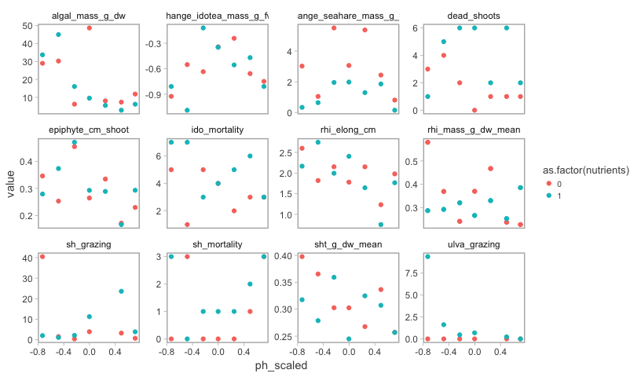
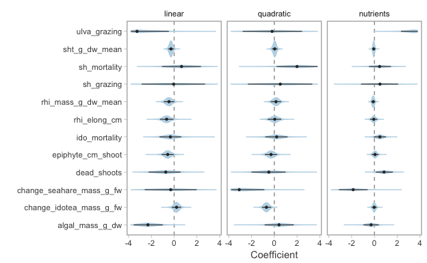
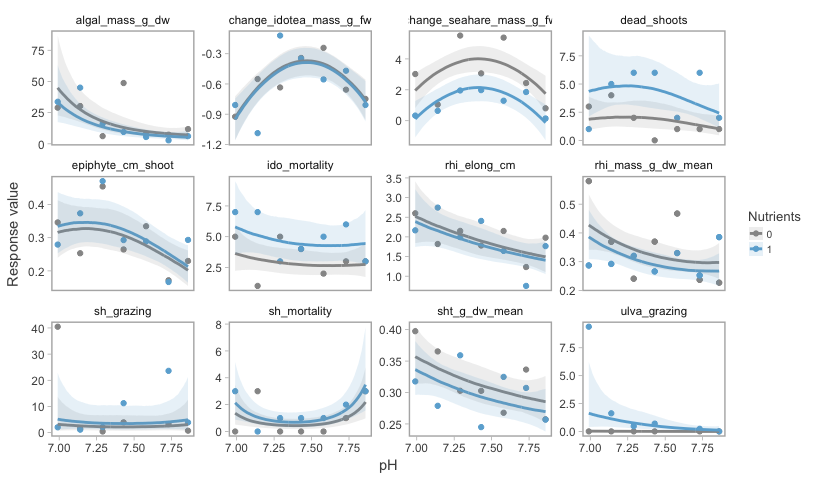

<!-- The .md filed is generated from the .Rmd. Please edit that file -->
Bayesian analysis of seagrass stressors
=======================================

``` r
library(tidyverse)
library(rstanarm)
library(RColorBrewer)
library(assertthat)
```

We'll create this folder in case it isn't already there.

``` r
dir.create("figs", showWarnings = FALSE)
```

A custom theme for ggplot:

``` r
theme_gg <- function(base_size = 11, base_family = "") {
  theme_light() +
    theme(
      panel.grid.major = element_blank(),
      panel.grid.minor = element_blank(),
      strip.background = element_rect(fill = NA, colour = NA),
      strip.text.x = element_text(colour = "grey10"),
      axis.text = element_text(colour = "grey30"),
      axis.title = element_text(colour = "grey30"),
      legend.title = element_text(colour = "grey30", size = rel(0.9)),
      panel.border = element_rect(fill = NA, colour = "grey70", size = 1),
      legend.key.size = unit(0.8, "lines"),
      legend.text = element_text(size = rel(0.7), colour = "grey30"),
      legend.key = element_rect(colour = NA)
    )
}
```

Let's read in the data and select only the columns we want to use:

``` r
d <- read_csv("data/Mesocosm_ExperimentalData_R.csv", na = c("NA", "na"))
#> Parsed with column specification:
#> cols(
#>   .default = col_double(),
#>   Barrel = col_integer(),
#>   Nutrients = col_character(),
#>   Dead_shoots = col_integer(),
#>   per_shoot_mortality = col_integer(),
#>   Shoot_survival = col_integer(),
#>   Ido_density = col_integer(),
#>   Ido_mortality = col_integer(),
#>   SH_density = col_integer(),
#>   SH_mortality = col_integer(),
#>   Grazer_density = col_integer(),
#>   Grazer_mortality = col_integer()
#> )
#> See spec(...) for full column specifications.
d <- mutate(d, id = as.character(pH))
names(d) <- tolower(names(d))
d$ph_scaled <- arm::rescale(d$ph)
d$nutrients_scaled <- arm::rescale(d$nutrients)
d$nutrients <- as.numeric(as.factor(d$nutrients)) - 1
d$ulva_grazing <- d$ulva_grazing + 0.01 # TODO fix

d_log <- select(d, 
  ph,
  ph_scaled,
  nutrients,
  epiphyte_cm_shoot,
  algal_mass_g_dw,
  rhi_mass_g_dw_mean,
  change_idotea_mass_g_fw,
  change_seahare_mass_g_fw,
  sht_g_dw_mean,
  rhi_mass_g_dw_mean,
  rhi_elong_cm,
  ido_mortality,
  sh_grazing,
  ulva_grazing,
  dead_shoots,
  sh_mortality)
```

Here I'm creating a data frame to merge in that describes the type of GLM to fit for each response variable:

``` r
# TODO use link:
dt <- tribble(
  ~response,                  ~log_transform,  ~family,     ~link,
  "ph_scaled",                NA,              "gaussian",  "identity",
  "nutrients",                NA,              "gaussian",  "identity",
  "algal_mass_g_dw",          TRUE,            "gaussian",  "identity",
  "change_idotea_mass_g_fw",  FALSE,           "gaussian",  "identity",
  "change_seahare_mass_g_fw", FALSE,           "gaussian",  "identity",
  "dead_shoots",              FALSE,           "count",     "log",
  "epiphyte_cm_shoot",        TRUE,            "gaussian",  "identity",
  "ido_mortality",            TRUE,            "gaussian",  "identity",
  "rhi_elong_cm",             TRUE,            "gaussian",  "identity",
  "rhi_mass_g_dw_mean",       TRUE,            "gaussian",  "identity",
  "rhi_mass_g_dw_mean",       TRUE,            "gaussian",  "identity",
  "sh_grazing",               TRUE,            "gaussian",  "identity",
  "sh_mortality",             FALSE,           "count",     "log",
  "sht_g_dw_mean",            TRUE,            "gaussian",  "identity",
  "ulva_grazing",             TRUE,            "gaussian",  "identity")

d_long <- gather(d_log, response, value, -ph_scaled, -nutrients, -ph)
d_long <- inner_join(d_long, dt) %>% na.omit() %>% as_data_frame()
#> Joining, by = "response"
```

Let's plot the data that we will fit models to:

``` r
ggplot(d_long, aes(ph_scaled, value, colour = as.factor(nutrients))) + 
  geom_point() +
  facet_wrap(~response, scales = "free_y") +
  theme_gg()
```



Now we can iterate through the various response variables and fit a Bayesian GLM to each. For now, I am log transforming some of the response variables and fitting a linear regression, to others I am fitting a linear regression to the raw data (the change response variables), and I am fitting negative binomial GLMs to the count response variables.

``` r
fits <- plyr::dlply(d_long, "response", function(x) {
  if (x$log_transform[1])
    f <- log(value) ~ poly(ph_scaled, 2) + nutrients
  else
    f <- value ~ poly(ph_scaled, 2) + nutrients
  
  if (x$family[1] == "gaussian")
    fam <- gaussian(link = "identity")
  if (x$family[1] == "count")
    fam <- neg_binomial_2(link = "log") # TODO Poisson(link = "log")?
    
  stan_glm(f, data = x, iter = 2000, chains = 4, family = fam,
    prior = normal(0, 2),
    prior_intercept = normal(0, 20),
    prior_aux = student_t(df = 3, 0, 3))
})
```

Let's check each of the models to make sure they converged:

``` r
check_out <- map(fits, function(x) {
  assert_that(all(x$stan_summary[,"Rhat"] < 1.05))
  assert_that(all(x$stan_summary[,"n_eff"] > 200))
})
```

Now let's extract the samples from the posteriors and make them into a nice data frame to work with:

``` r
s <- plyr::ldply(fits, function(x) {
  mm <- as.matrix(x)
  as_data_frame(mm[, 2:4])
  }) %>% as_data_frame() %>%
  rename(linear = `poly(ph_scaled, 2)1`, quadratic = `poly(ph_scaled, 2)2`)
```

Here I will calculate credible intervals to plot:

``` r
cis <- gather(s, parameter, value, -response) %>% 
  group_by(response, parameter) %>% 
  summarise(l = quantile(value, 0.05),
    m = quantile(value, 0.5),
    u = quantile(value, 0.95)) %>% 
  ungroup() %>% 
  mutate(parameter = factor(parameter, levels = c("linear", "quadratic", "nutrients")))
```

Now let's plot the coefficients with the credible intervals overlaid:

``` r
lims <- c(-3.8, 3.8)
cis$l[cis$l < lims[1]] <- lims[1]
cis$u[cis$u > lims[2]] <- lims[2]
cols <- rep(brewer.pal(4, "Blues")[[2]], 2)
g <- gather(s, parameter, sample, -response) %>%
  inner_join(unique(select(d_long, response, log_transform, family))) %>%
  mutate(multiplicative = ifelse(log_transform | family == "count", TRUE, FALSE)) %>%
  mutate(parameter = factor(parameter, levels = c("linear", "quadratic", "nutrients"))) %>%
  ggplot(aes(response, sample)) + 
  geom_hline(yintercept = 0, lty = 2, col = "grey60") +
  geom_violin(fill = cols[1], col = cols[2], adjust = 1.2) +
  coord_flip() +
  facet_wrap(~parameter, scales = "free_x") +
  # scale_y_continuous(limits = c(-3.2, 3.2)) +
  ylim(lims) +
  theme_gg() +
  ylab("Coefficient") + xlab("") +
  geom_point(data = cis, aes(x = response, y = m), col = "grey20", cex = 0.9) +
  geom_segment(data = cis, aes(x = response, y = l, xend = response, yend = u), 
    lwd = 0.4, col = "grey20")
#> Joining, by = "response"
g
#> Warning: Removed 5559 rows containing non-finite values (stat_ydensity).
#> Warning: Removed 1 rows containing missing values (geom_point).
```



``` r
ggsave("figs/gg-pars.pdf", width = 7, height = 4)
#> Warning: Removed 5559 rows containing non-finite values (stat_ydensity).

#> Warning: Removed 1 rows containing missing values (geom_point).
```

Next we will plot the model fits on top of the data. First we will need to create a data set with smaller increments on the predictors so that the plots are smooth:

``` r
# TODO:
# newdata <- expand.grid(ph_scaled = seq(min(d$ph_scaled), max(d$ph_scaled), length.out = 200), 
#   nutrients = c(0, 1))
# newdata <- data.frame(newdata, linear = poly(newdata$ph_scaled, 2)[,1], 
  # quad = poly(newdata$ph_scaled, 2)[,2], ph = newdata$ph_scaled * 2 * sd(d$ph) + mean(d$ph))

newdata <- unique(select(d, ph_scaled, ph, nutrients))

newdata <- data.frame(newdata, linear = poly(newdata$ph_scaled, 2)[,1], 
  quad = poly(newdata$ph_scaled, 2)[,2])

N <- 250
newdata <- group_by(newdata, nutrients) %>%
  do({
    data.frame(ph_scaled = spline(.$ph_scaled, n = N)$y,
      ph = spline(.$ph, n = N)$y,
      linear = spline(.$linear, n = N)$y,
      quad = spline(.$quad, n = N)$y) # TODO use spline approx?
  })
```

Now make the predictions:

``` r
p <- plyr::ldply(fits, function(x) {
  mm <- as.matrix(x)
  b <- as_data_frame(mm) %>% rename(
    b0 = `(Intercept)`,
    b1 = `poly(ph_scaled, 2)1`,
    b2 = `poly(ph_scaled, 2)2`)
  pp <- apply(newdata, 1, function(y) {
    b$b0 + b$b1 * y["linear"] + b$b2 * y["quad"] + b$nutrients * y["nutrients"]
  })
  l <- apply(pp, 2, quantile, probs = 0.1)
  u <- apply(pp, 2, quantile, probs = 0.9)
  med <- apply(pp, 2, quantile, probs = 0.5)
  data.frame(l, med, u, newdata)
}) %>% as_data_frame()

pp <- inner_join(p, unique(select(d_long, response, log_transform, family)))
#> Joining, by = "response"
pp <- pp %>% group_by(response) %>% 
  mutate(med = ifelse(log_transform | family == "count", exp(med), med)) %>% 
  mutate(l = ifelse(log_transform | family == "count", exp(l), l)) %>% 
  mutate(u = ifelse(log_transform | family == "count", exp(u), u))
```

And finally make the plot:

``` r
cols <- c(brewer.pal(4, "Greys")[[3]], brewer.pal(4, "Blues")[[3]])
g <- ggplot(d_long, aes(ph, value, colour = as.factor(nutrients))) + 
  geom_point() +
  facet_wrap(~response, scales = "free_y") +
  geom_line(data = pp, aes(ph, y = med), lwd = 1) +
  geom_ribbon(data = pp, aes(ph, ymax = u, ymin = l, fill = as.factor(nutrients)), 
    alpha = 0.15, inherit.aes = FALSE) +
  theme_gg() +
  labs(colour = "Nutrients", fill = "Nutrients", y = "Response value", x = "pH") +
  scale_color_manual(values = cols) + scale_fill_manual(values = cols)
g
```



``` r
ggsave("figs/gg-fits.pdf", width = 10, height = 6)
```
