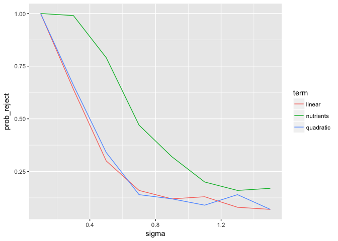

<!-- The .md filed is generated from the .Rmd. Please edit that file -->
Power analysis
==============

Power refers to the probability of correctly rejecting the null hypothesis when the alternative hypothesis (that the coefficient is not equal to 0) is true. I.e., it's the probability of detecting an effect when in fact there is an effect to detect.

``` r
library(tidyverse)
#> Loading tidyverse: ggplot2
#> Loading tidyverse: tibble
#> Loading tidyverse: tidyr
#> Loading tidyverse: readr
#> Loading tidyverse: purrr
#> Loading tidyverse: dplyr
#> Conflicts with tidy packages ----------------------------------------------
#> filter(): dplyr, stats
#> lag():    dplyr, stats
```

Let's read in the data:

``` r
d <- readRDS("data/generated/data-clean.rds")
d <- unique(select(d, ph_scaled, ph, nutrients))
```

Let's start by looking at reasonable values for parameters and residual standard deviation based on the model fits.

``` r
fits <- readRDS("data/generated/stan-fits.rds")
coefficients <- lapply(fits, broom::tidyMCMC, estimate.method = "median") %>%
  plyr::ldply()
coefficients <- mutate(coefficients, estimate = round(estimate, 2),
  std.error = round(std.error, 2)) %>%
  filter(term != "(Intercept)") %>% 
  arrange(term)
knitr::kable(coefficients)
```

| .id                          | term                   |  estimate|  std.error|
|:-----------------------------|:-----------------------|---------:|----------:|
| algal\_mass\_g\_dw           | nutrients              |     -0.31|       0.41|
| change\_idotea\_mass\_g\_fw  | nutrients              |     -0.01|       0.13|
| change\_seahare\_mass\_g\_fw | nutrients              |     -1.85|       0.77|
| dead\_shoots                 | nutrients              |      0.84|       0.46|
| epiphyte\_cm\_shoot          | nutrients              |      0.05|       0.18|
| ido\_mortality               | nutrients              |      0.47|       0.31|
| rhi\_elong\_cm               | nutrients              |     -0.06|       0.19|
| rhi\_mass\_g\_dw\_mean       | nutrients              |     -0.11|       0.11|
| sh\_grazing                  | nutrients              |      0.51|       1.05|
| sh\_mortality                | nutrients              |      0.47|       0.61|
| sht\_g\_dw\_mean             | nutrients              |     -0.06|       0.08|
| ulva\_grazing                | nutrients              |      3.83|       0.91|
| algal\_mass\_g\_dw           | poly(ph\_scaled, 2)1   |     -2.26|       0.77|
| change\_idotea\_mass\_g\_fw  | poly(ph\_scaled, 2)1   |      0.21|       0.26|
| change\_seahare\_mass\_g\_fw | poly(ph\_scaled, 2)1   |     -0.31|       1.41|
| dead\_shoots                 | poly(ph\_scaled, 2)1   |     -0.76|       0.87|
| epiphyte\_cm\_shoot          | poly(ph\_scaled, 2)1   |     -0.55|       0.33|
| ido\_mortality               | poly(ph\_scaled, 2)1   |     -0.34|       0.60|
| rhi\_elong\_cm               | poly(ph\_scaled, 2)1   |     -0.67|       0.34|
| rhi\_mass\_g\_dw\_mean       | poly(ph\_scaled, 2)1   |     -0.46|       0.27|
| sh\_grazing                  | poly(ph\_scaled, 2)1   |     -0.01|       1.82|
| sh\_mortality                | poly(ph\_scaled, 2)1   |      0.60|       1.04|
| sht\_g\_dw\_mean             | poly(ph\_scaled, 2)1   |     -0.27|       0.15|
| ulva\_grazing                | poly(ph\_scaled, 2)1   |     -3.29|       1.60|
| algal\_mass\_g\_dw           | poly(ph\_scaled, 2)2   |      0.42|       0.80|
| change\_idotea\_mass\_g\_fw  | poly(ph\_scaled, 2)2   |     -0.69|       0.25|
| change\_seahare\_mass\_g\_fw | poly(ph\_scaled, 2)2   |     -3.17|       1.41|
| dead\_shoots                 | poly(ph\_scaled, 2)2   |     -0.51|       0.89|
| epiphyte\_cm\_shoot          | poly(ph\_scaled, 2)2   |     -0.28|       0.34|
| ido\_mortality               | poly(ph\_scaled, 2)2   |      0.24|       0.58|
| rhi\_elong\_cm               | poly(ph\_scaled, 2)2   |      0.04|       0.35|
| rhi\_mass\_g\_dw\_mean       | poly(ph\_scaled, 2)2   |      0.15|       0.28|
| sh\_grazing                  | poly(ph\_scaled, 2)2   |      0.56|       1.74|
| sh\_mortality                | poly(ph\_scaled, 2)2   |      1.95|       1.12|
| sht\_g\_dw\_mean             | poly(ph\_scaled, 2)2   |      0.04|       0.16|
| ulva\_grazing                | poly(ph\_scaled, 2)2   |     -0.24|       1.64|
| dead\_shoots                 | reciprocal\_dispersion |      3.99|       4.25|
| sh\_mortality                | reciprocal\_dispersion |      3.15|       4.86|
| algal\_mass\_g\_dw           | sigma                  |      0.74|       0.20|
| change\_idotea\_mass\_g\_fw  | sigma                  |      0.23|       0.06|
| change\_seahare\_mass\_g\_fw | sigma                  |      1.31|       0.35|
| epiphyte\_cm\_shoot          | sigma                  |      0.31|       0.09|
| ido\_mortality               | sigma                  |      0.56|       0.15|
| rhi\_elong\_cm               | sigma                  |      0.33|       0.09|
| rhi\_mass\_g\_dw\_mean       | sigma                  |      0.27|       0.04|
| sh\_grazing                  | sigma                  |      1.67|       0.50|
| sht\_g\_dw\_mean             | sigma                  |      0.15|       0.04|
| ulva\_grazing                | sigma                  |      1.49|       0.46|

The next few chunks include some functions to do the simulations for power analysis:

``` r
generate_response <- function(sigma = 0.7, b0 = 2, b1 = -2, b2 = 0.5, b3 = 0.2, trans = exp) {
  trans(rnorm(nrow(x), b0 + d$linear * b1 + d$quadratic * b2 + d$nutrients * b3, sd = sigma))
}
```

``` r
x <- poly(d$ph_scaled, 2)
d$linear <- x[,1]
d$quadratic <- x[,2]

fit_model <- function(sigma = 0.7, b0 = 2, b1 = -2, b2 = 0.5, b3 = 0.2, trans = exp,
  formula = "log(response) ~ linear + quadratic + nutrients") {
    
  dd <- d
  dd$response <- generate_response(sigma = sigma, b0 = b0, b1 = b1, b2 = b2, b3 = b3, trans = trans)
  
  m <- lm(as.formula(formula), data = dd)
  b <- broom::tidy(m)
  data.frame(term = b$term, p.value = b$p.value)
}
```

``` r
power_analysis <- function(n, thresh = 0.05, sigma = 0.5, b0 = 0, b1 = -0.5, b2 = -0.5, b3 = 0.5, trans = exp, ...) {
  out <- plyr::rdply(n, function(xx) 
    fit_model(sigma = sigma, b0 = b0, b1 = b1, b2 = b2, b3 = b3, trans = trans, ...))
  out %>% group_by(term) %>% 
    summarize(prob_reject = round(sum(p.value < thresh) / n(), 2)) %>%
    mutate(sigma = sigma, b0 = b0, b1 = b1, b2 = b2, b3 = b3)
}
```

Now we can run our analysis for a given number of simulations, a given p-value threshold, a given amount of residual standard deviation noise, and given magnitudes of predictors:

``` r
power_analysis(300, thresh = 0.05, sigma = 0.5, b0 = 0, b1 = -0.5, b2 = -0.5, b3 = 0.5, trans = exp)
#> # A tibble: 4 × 7
#>          term prob_reject sigma    b0    b1    b2    b3
#>        <fctr>       <dbl> <dbl> <dbl> <dbl> <dbl> <dbl>
#> 1 (Intercept)        0.06   0.5     0  -0.5  -0.5   0.5
#> 2      linear        0.15   0.5     0  -0.5  -0.5   0.5
#> 3   nutrients        0.34   0.5     0  -0.5  -0.5   0.5
#> 4   quadratic        0.13   0.5     0  -0.5  -0.5   0.5
power_analysis(300, thresh = 0.05, sigma = 0.4, b0 = 2, b1 = -0.5, b2 = -0.5, b3 = 0, trans = exp)
#> # A tibble: 4 × 7
#>          term prob_reject sigma    b0    b1    b2    b3
#>        <fctr>       <dbl> <dbl> <dbl> <dbl> <dbl> <dbl>
#> 1 (Intercept)        1.00   0.4     2  -0.5  -0.5     0
#> 2      linear        0.21   0.4     2  -0.5  -0.5     0
#> 3   nutrients        0.06   0.4     2  -0.5  -0.5     0
#> 4   quadratic        0.21   0.4     2  -0.5  -0.5     0
power_analysis(300, thresh = 0.05, sigma = 0.4, b0 = 2, b1 = -0.5, b2 = -0.5, b3 = 0, trans = exp,
  formula = "log(response) ~ linear + quadratic")
#> # A tibble: 3 × 7
#>          term prob_reject sigma    b0    b1    b2    b3
#>        <fctr>       <dbl> <dbl> <dbl> <dbl> <dbl> <dbl>
#> 1 (Intercept)        1.00   0.4     2  -0.5  -0.5     0
#> 2      linear        0.17   0.4     2  -0.5  -0.5     0
#> 3   quadratic        0.20   0.4     2  -0.5  -0.5     0
```

Given that the sample size is fixed (the experiment is already done), it would seem that the main point of interest is if we can detect effects given a certain magnitude of an effect with a given amount of residual noise.

For example, given true coefficient values of magnitude 0.8, the following is the power across increasing magnitude of residual standard deviation noise:

``` r
out <- plyr::ldply(seq(0.1, 1.5, length.out = 8), function(si) 
  power_analysis(n = 300, sigma = si, b0 = 2, b1 = -0.8, b2 = -0.8, b3 = 0.8, trans = exp))
filter(out, term %in% c("linear", "quadratic", "nutrients")) %>% 
  ggplot(aes(sigma, prob_reject, colour = term)) + geom_line()
```


